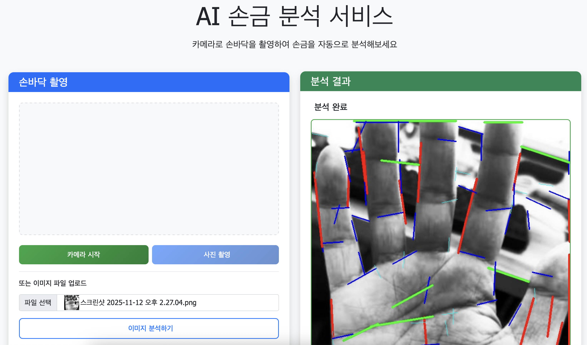
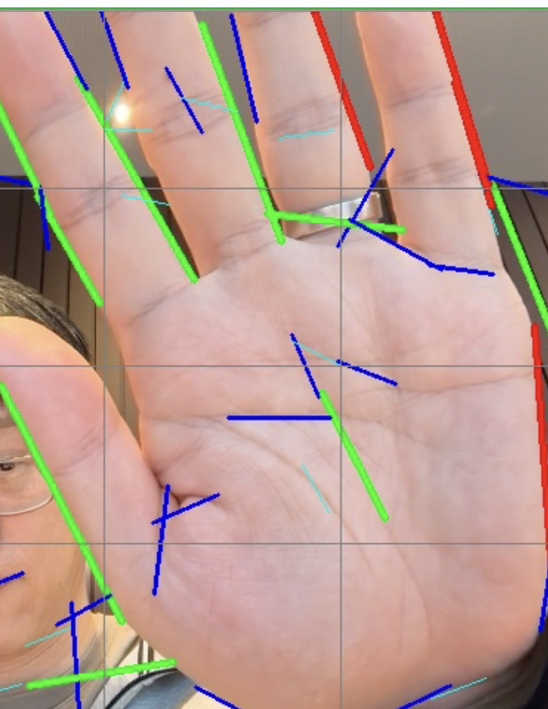

# Palm Analyzer - AI 손금 분석 서비스


**AI-powered palm line analysis web service using OpenCV and machine learning**

OpenCV와 머신러닝을 활용한 실시간 손금 분석 웹 서비스입니다. mediapipe 를 사용해서 좀더 쉽게 손금을 추출하는것이 좋을것 같고 향후 손금 운명데이터를 벡터 db로 저장하면 좋을것 같습니다. 관심 있으신 분은 연락주세요.

## 🌟 English Description

**Palm Analyzer** is an advanced web-based application that uses computer vision and machine learning to analyze palm lines in real-time. Built with OpenCV, Flask, and modern web technologies, it provides accurate palm line detection and classification through your browser's camera or uploaded images.

### ✨ Key Features
- 📸 **Real-time camera capture** - Direct palm photography through web browser
- 🔍 **Advanced line detection** - Using Canny edge detection and Hough transforms
- 🤖 **ML-powered classification** - Automatic categorization of palm line types
- 📊 **Detailed analytics** - Statistical analysis and visualization
- 💾 **Export functionality** - Download analyzed images
- 📱 **Responsive design** - Works on desktop and mobile devices

## 📸 스크린샷

### 메인 인터페이스

### 손금 추출



## 주요 기능

- 📸 **실시간 카메라 촬영**: 웹 브라우저에서 직접 손바닥 촬영
- 📁 **이미지 파일 업로드**: 기존 이미지 파일을 업로드하여 분석
- 🔍 **고급 손금 추출**: OpenCV의 Canny 엣지 검출과 Hough 변환을 활용
- 📊 **상세 분석 결과**: 손금 타입별 분류 및 통계 제공
- 💾 **결과 다운로드**: 분석된 이미지 다운로드 기능
- 📱 **반응형 디자인**: 모바일과 데스크톱 모든 환경 지원

## 기술 스택

### Backend
- **Flask**: Python 웹 프레임워크
- **OpenCV**: 컴퓨터 비전 라이브러리
- **NumPy**: 수치 계산 라이브러리
- **scikit-image**: 이미지 처리 라이브러리
- **scikit-learn**: 머신러닝 라이브러리 (클러스터링)

### Frontend
- **HTML5**: 구조 및 마크업
- **CSS3**: 스타일링 및 애니메이션
- **JavaScript (ES6+)**: 동적 기능 및 API 통신
- **Bootstrap 5**: UI 프레임워크
- **Font Awesome**: 아이콘

### 손금 분석 알고리즘

Stack Overflow의 [Detecting palm lines with OpenCV in Python](https://stackoverflow.com/questions/58080624/detecting-palm-lines-with-opencv-in-python) 제안사항을 반영하여 개발된 고도화된 알고리즘을 사용합니다:

1. **이미지 전처리**
   - 히스토그램 균등화
   - CLAHE (Contrast Limited Adaptive Histogram Equalization)
   - 가우시안 블러를 통한 노이즈 제거

2. **손 영역 검출**
   - HSV 색상공간에서 피부색 검출
   - 형태학적 연산을 통한 마스크 정제
   - 최대 컨투어를 이용한 손 영역 분리

3. **손금 강화**
   - Sobel 연산자를 이용한 그래디언트 계산
   - Sato 리지 필터 적용
   - 형태학적 연산을 통한 선 구조 강화

4. **고급 라인 검출**
   - Canny 엣지 검출
   - Hough Line Transform
   - 라인 길이 및 각도 기반 필터링

5. **라인 분류 및 클러스터링**
   - 라인 길이와 방향에 따른 타입 분류
   - DBSCAN 클러스터링을 통한 유사 라인 그룹화
   - 손바닥 영역을 4x4 그리드로 분할하여 분석

## 설치 방법

### 1. 레포지토리 클론
```bash
git clone <repository-url>
cd palmAnalyzer
```

### 2. 자동 설치 (권장)
```bash
chmod +x install.sh
./install.sh
```

### 3. 수동 설치
```bash
# Python 가상환경 생성
python3 -m venv palm_env

# 가상환경 활성화
source palm_env/bin/activate  # macOS/Linux
# 또는
palm_env\Scripts\activate     # Windows

# 패키지 설치
pip install -r requirements.txt
```

## 실행 방법

### 자동 실행
```bash
chmod +x run.sh
./run.sh
```

### 수동 실행
```bash
# 가상환경 활성화 (이미 활성화된 경우 스킵)
source palm_env/bin/activate

# 서버 시작
python app.py
```

서버가 시작되면 웹 브라우저에서 `http://localhost:8000`으로 접속하세요.

## 사용 방법

1. **카메라 촬영 방식**
   - "카메라 시작" 버튼 클릭
   - 손바닥을 카메라에 가까이 대고 "사진 촬영" 클릭
   - "손금 분석하기" 버튼으로 분석 시작

2. **파일 업로드 방식**
   - "파일 선택" 버튼으로 이미지 선택
   - "이미지 분석하기" 버튼 클릭

3. **결과 확인**
   - 검출된 손금이 색상별로 표시된 이미지 확인
   - 라인 유형별 통계 정보 확인
   - 필요시 결과 이미지 다운로드

## 프로젝트 구조

```
palmAnalyzer/
├── app.py                 # Flask 메인 애플리케이션
├── requirements.txt       # Python 패키지 의존성
├── install.sh            # 자동 설치 스크립트
├── run.sh               # 자동 실행 스크립트
├── README.md            # 프로젝트 문서
├── modules/
│   └── palm_detector.py # 손금 분석 모듈
├── static/
│   ├── css/
│   │   └── style.css    # CSS 스타일
│   └── js/
│       └── app.js       # JavaScript 클라이언트
├── templates/
│   └── index.html       # HTML 템플릿
└── uploads/             # 업로드된 이미지 임시 저장
```

## API 엔드포인트

### POST `/analyze`
손금 분석을 수행합니다.

**Request:**
- `Content-Type: multipart/form-data`
- `image`: 이미지 파일 (PNG, JPG, JPEG, GIF, BMP)

**Response:**
```json
{
    "success": true,
    "processed_image": "base64_encoded_image",
    "total_lines": 15,
    "major_lines": 5,
    "medium_lines": 7,
    "minor_lines": 3,
    "line_types": ["major_vertical", "major_horizontal", "medium"],
    "processing_time": 2.34,
    "image_size": {
        "width": 640,
        "height": 480
    }
}
```

### GET `/health`
서버 상태를 확인합니다.

## 지원하는 이미지 형식

- PNG
- JPEG/JPG
- GIF
- BMP

최대 파일 크기: 16MB

## 브라우저 호환성

- Chrome (권장)
- Firefox
- Safari
- Edge

카메라 기능은 HTTPS 환경에서 더 안정적으로 작동합니다.

## 문제 해결

### 카메라가 작동하지 않는 경우
1. 브라우저의 카메라 권한이 허용되어 있는지 확인
2. HTTPS 환경에서 실행 (로컬에서는 localhost 사용)
3. 다른 애플리케이션에서 카메라를 사용하고 있지 않은지 확인

### 분석이 실패하는 경우
1. 손바닥이 선명하게 보이는 이미지인지 확인
2. 적절한 조명 환경에서 촬영
3. 손가락이 아닌 손바닥 부분이 잘 보이는지 확인

### 패키지 설치 오류
1. Python 3.7 이상 버전 사용 확인
2. pip 최신 버전으로 업그레이드
3. 시스템별 OpenCV 설치 요구사항 확인

## 라이선스

MIT License

## 연락처

프로젝트에 대한 문의나 제안사항이 있으시면 이슈를 등록해주세요.

---

**주의사항**: 이 프로젝트는 교육 및 연구 목적으로 개발되었습니다. 실제 운세나 의료 진단 목적으로 사용해서는 안 됩니다.

## 📞 문의하기

**개발 관련 컨설팅 및 외주 받습니다.**

### 👨‍💼 프로젝트 관리자 연락처

**Email**: [hyun.lim@okkorea.net](mailto:hyun.lim@okkorea.net)  
**Homepage**: [https://www.okkorea.net](https://www.okkorea.net)

### 🛠️ 전문 분야

- **IoT 시스템 설계 및 개발**
- **임베디드 소프트웨어 개발** (Arduino, ESP32)
- **AI 서비스 개발** (LLM, MCP Agent)
- **클라우드 서비스 구축** (Google Cloud Platform)
- **하드웨어 프로토타이핑**

### 💼 서비스

- **기술 컨설팅**: IoT 프로젝트 기획 및 설계 자문
- **개발 외주**: 펌웨어부터 클라우드까지 Full-stack 개발
- **교육 서비스**: 임베디드/IoT 개발 교육 및 멘토링
